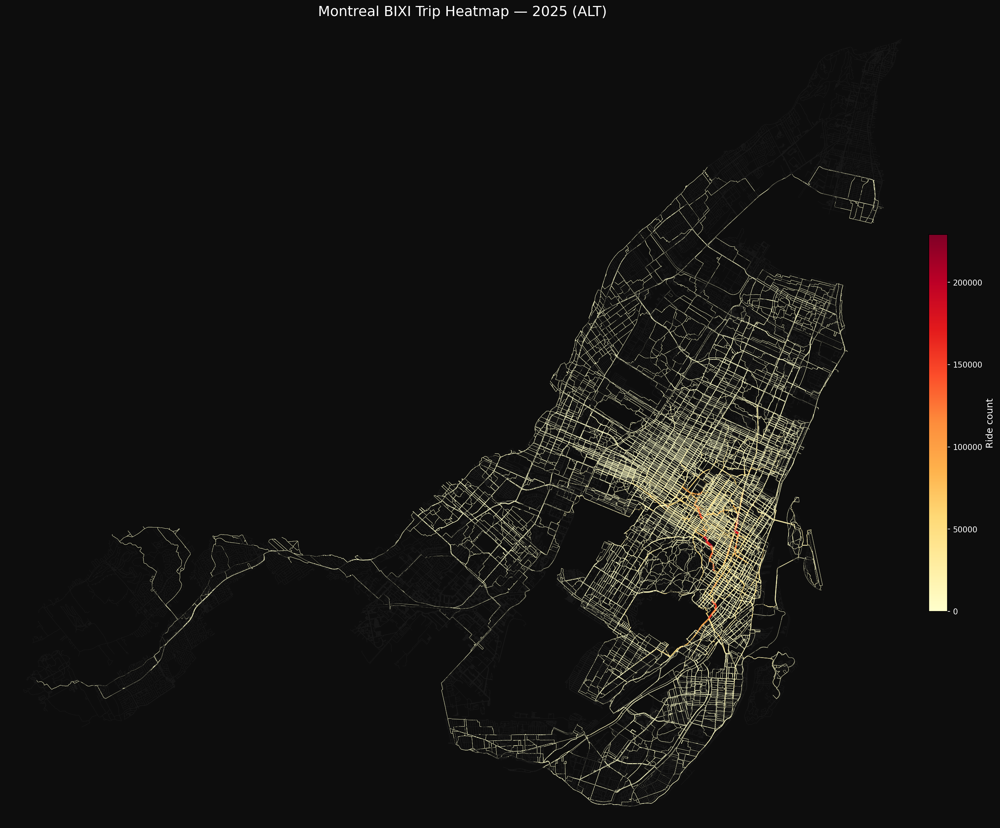
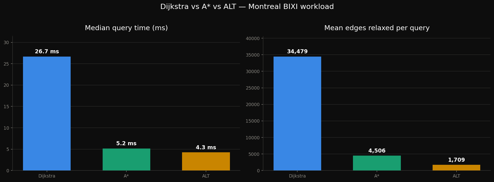
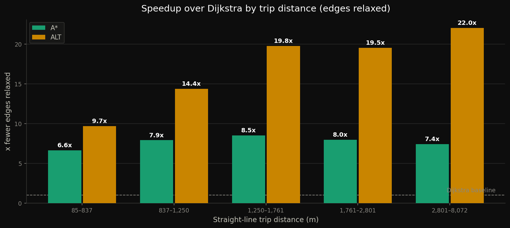
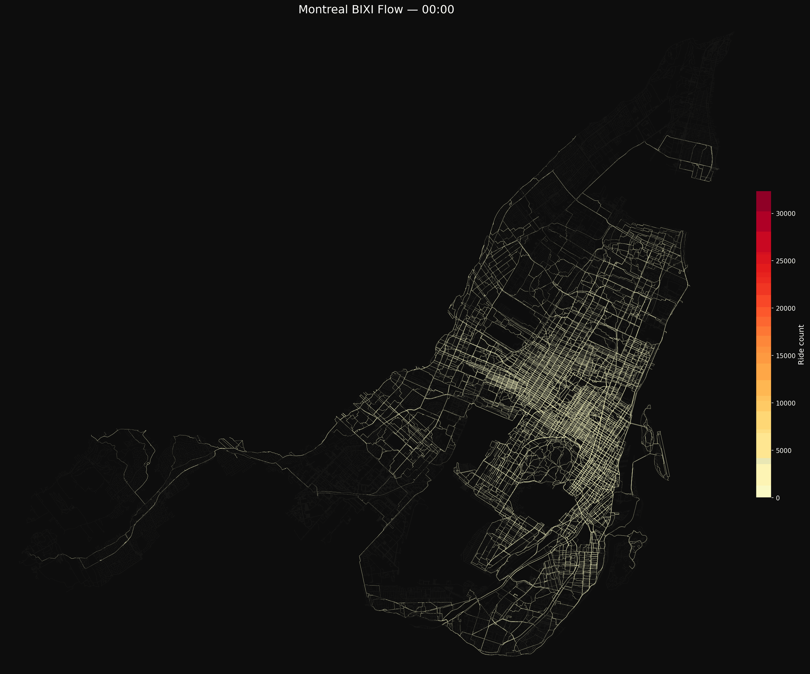
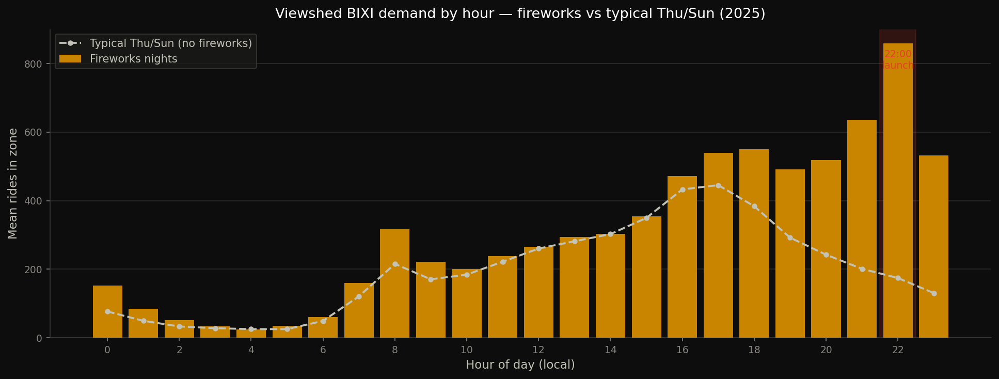

# BIXI Montreal: Network Flow, Routing, and Anomaly Detection

Routing Montreal's real 2022 to 2026 [BIXI](https://donnees.montreal.ca/en/dataset/bixi-historique-des-deplacements?)
bike share trips over the actual street network to estimate where riders' traffic flows, plus the
sources and sinks that flow creates. Every trip is a station to station record. This project turns
tens of thousands of unique origin destination pairs into shortest paths across the Montreal bike
plus walk graph, accumulates the load on every street segment, and breaks it down by hour, by day,
and by station.

Alongside the mapping, the repo benchmarks the routing algorithms that make it tractable (Dijkstra
vs A\* vs ALT) and includes two demand anomaly studies: Parc Jean-Drapeau island events, and a
machine learning model that detects and predicts La Ronde fireworks nights from the post show BIXI
exodus.



## Repo layout

The work is split into three self contained folders, plus shared `output/` (figures and results)
and `cache/` (regenerable graph and load pickles).

| Folder | What it covers |
|---|---|
| [`bixi_visualization/`](bixi_visualization/) | The main flow pipeline and maps. |
| [`bixi_algorithm_benchmark/`](bixi_algorithm_benchmark/) | Dijkstra vs A\* vs ALT on the real workload. |
| [`bixi_anomaly_detection_ml/`](bixi_anomaly_detection_ml/) | Jean-Drapeau event anomalies and the La Ronde fireworks predictor (has its own [README](bixi_anomaly_detection_ml/README.md)). |

## What's here

### `bixi_visualization/`

| Notebook | What it does |
|---|---|
| **`bixi_montreal.ipynb`** | The main pipeline. Loads BIXI stations and trips, builds the composed bike plus walk street graph with OSMnx, routes every unique OD pair with ALT, and accumulates per edge and per hour load. Produces the Montreal wide flow maps, the 24 panel hourly grid, the day by hour ridership heatmap, the station net flow (source and sink) map, the weekday vs weekend pattern, and animated flow fields where each dot's speed tracks that segment's ridership. |
| **`bixi_south_shore.ipynb`** | Earlier South Shore (Longueuil and Brossard) heatmap, the precursor to the Montreal wide pipeline. |

### `bixi_algorithm_benchmark/`

| Notebook | What it does |
|---|---|
| **`algorithm_benchmark.ipynb`** | Benchmarks Dijkstra vs A\* vs ALT on the real BIXI workload, with OD pairs sampled from the trip table and weighted by trip frequency. Measures correctness, heuristic admissibility, query time, search space (edges relaxed), preprocessing cost, and how the speedup scales with trip distance and landmark count. Includes a break even analysis: ALT's landmark preprocessing pays for itself after about 1,200 queries against Dijkstra, and the full pipeline issues over 537,000. |
| **`shortest_path_testing.ipynb`** | Scratch and validation notebook. Strongly connected component checks and the bike plus walk graph construction the pipeline relies on, notably keeping the Jacques-Cartier bridge path that a bike only graph drops. |

### `bixi_anomaly_detection_ml/`

| File | What it does |
|---|---|
| **`firework_anomaly_train.ipynb`** | Trains a classifier on four seasons (2022 to 2025) to detect La Ronde fireworks nights from the riverfront BIXI exodus, evaluated leave one year out. Exports the fitted model to `output/firework_model.joblib`. |
| **`predict_fireworks.py`** | Inference only CLI. Loads the saved model, runs the shared preprocessing on a new season's CSV, and ranks the nights most likely to have hosted a show. |
| **`firework_features.py`**, **`fireworks_dates.json`** | Shared feature engineering (imported by both the notebook and the CLI so they never drift), and the ground truth IFLQ fireworks calendars. |
| **`jean_drapeau_anomaly/jean_drapeau_anomaly.ipynb`** | Anomaly detection on Parc Jean-Drapeau island demand: does anomalous ridership line up with known island events (F1 Grand Prix, Osheaga, ÎleSoniq, Piknic Électronik)? Baselines demand per (month, day of week), robust MAD z scores the residual, and controls for weather. |

See the [folder README](bixi_anomaly_detection_ml/README.md) for the fireworks pipeline in detail.

## Key results

### Routing: ALT wins on the real workload
Because the same OD pairs are reused across roughly 24 hourly snapshots, the up front cost of ALT's
landmark preprocessing amortizes over many queries, exactly the regime it is built for. A\* and ALT
both return provably optimal paths (verified against Dijkstra), so route lengths are identical. ALT
just relaxes far fewer edges per query.




### Diurnal flow
Corridors light up for the morning commute, shift downtown, and reverse in the evening. Weekdays
show a commute driven double peak (8am and 5pm); weekends show a broader midday peak.




### Station net flow
Arrivals minus departures per station: which stations are net sinks (fill up, need bikes removed)
versus net sources (drain out, need bikes added).


### Fireworks detection
The riverfront exodus after the 22:00 show is a clean signal. In the hour by hour profile, fireworks
nights spike after launch in a way ordinary evenings on the same weekday do not.



Figures live in each folder's `output/`. The fireworks and Jean-Drapeau figures are still in the
shared root [`output/`](output/), since `bixi_anomaly_detection_ml/output/` has none moved over yet.

## Setup

```bash
python3 -m venv venv
source venv/bin/activate
pip install -r requirements.txt
```

Open the notebooks from the repo root as your workspace, then run each one top to bottom. The
notebooks and scripts use relative paths (`output/`, `cache/`), so keeping the working directory at
the repo root is what makes them resolve.

### Data

The notebooks read BIXI open data from an external drive:

```
station_information.json                                  # station metadata (GBFS)
DonneesOuverte2022.csv                                    # 2022 trips
DonneesOuvertes2023_12.csv                                # 2023 trips
DonneesOuvertes2024_010203040506070809101112.csv         # 2024 trips
DonneesOuvertes2025_010203040506070809101112.csv         # 2025 trips (full season)
DonneesOuvertes2026_01020304.csv                          # 2026 trips (Jan to Apr)
```

Paths are set at the top of each notebook and currently point at `/Volumes/Extreme SSD/SUMO Data/`.
Edit them to match where you keep the data. Trip CSVs come from
[Montreal's BIXI open data](https://donnees.montreal.ca/en/dataset/bixi-historique-des-deplacements?);
weather is fetched from the free [Open-Meteo historical archive API](https://open-meteo.com/en/docs/historical-weather-api).

OSMnx graph downloads and the composed bike plus walk graph are cached under `cache/` (gitignored),
so the slow graph build steps run only once.

## Notes

- Routes on a composed bike plus walk graph (`nx.compose`), because cyclists share key links (notably
  the Jacques-Cartier bridge bike lane) with pedestrians, and a bike only network silently drops them.
- The benchmark restricts to the largest strongly connected component, so every sampled query is
  routable. The production pipeline routes the full composed graph and skips unreachable pairs.
- `cache/montreal_edge_loads.pkl` is the cached per edge and per hour load. The visualization cells
  re-run from it without recomputing all the paths.
