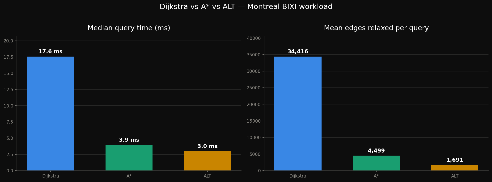
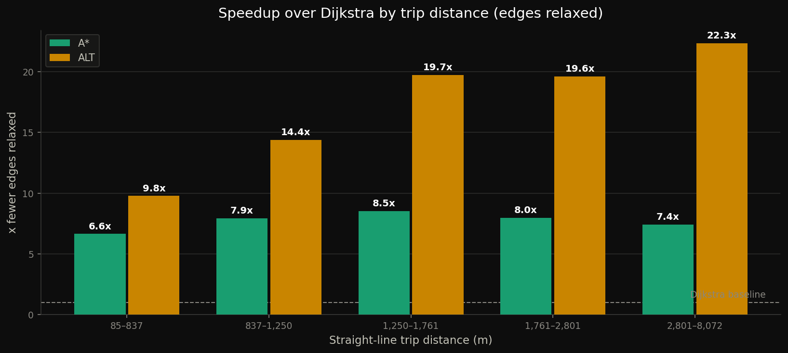
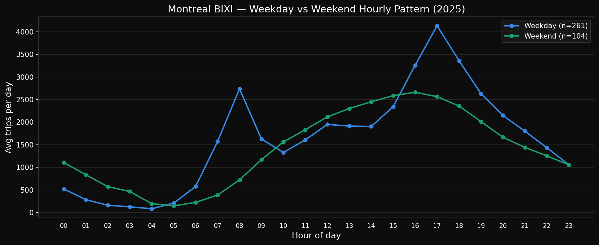
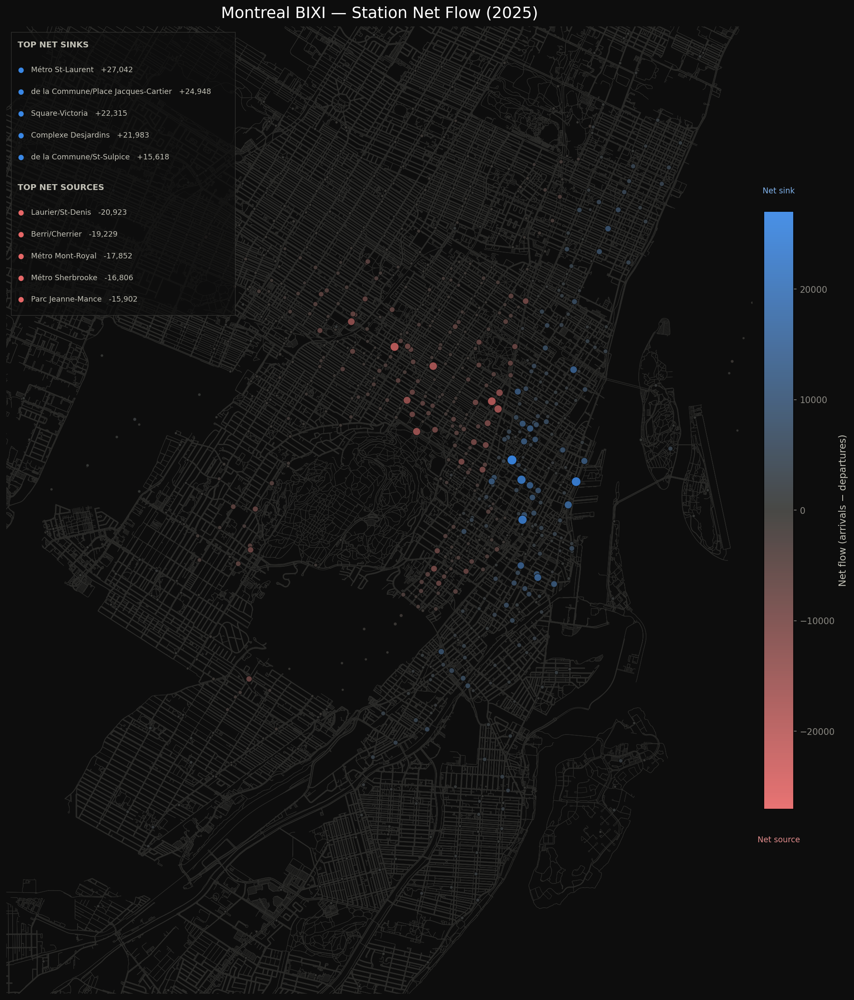
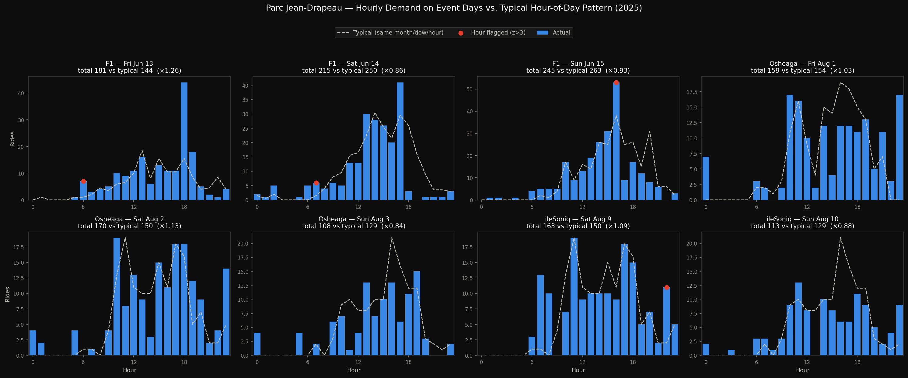

# BIXI Montreal — Network Flow & Routing Analysis

Routing Montreal's real 2025–2026 [BIXI](https://donnees.montreal.ca/en/dataset/bixi-historique-des-deplacements?) bike-share trips over the actual
street network to estimate **riders' traffic flow**, along with sources and destinations. Every trip is a
station-to-station record; this project turns tens of thousands of unique origin–destination pairs
into shortest paths across the Montreal bike + walk graph, which accumulates the load on every street
segment, and breaks it down by hour, by day, and by station.


Alongside the mapping work, the repo benchmarks the routing algorithms that make it tractable
(Dijkstra vs A\* vs ALT) and includes a demand-anomaly study of Parc Jean-Drapeau island events.

## What's here

| Notebook | What it does |
|---|---|
| **`bixi_montreal.ipynb`** | The main pipeline. Loads BIXI stations and trips, builds the composed bike+walk street graph with OSMnx, routes every unique OD pair with **ALT**, and accumulates per-edge / per-hour load. Produces the Montreal-wide heatmap, the 24-panel hourly grid, the animated GIF, the day×hour ridership heatmap, the station net-flow (source/sink) map, and the weekday-vs-weekend pattern. |
| **`algorithm_benchmark.ipynb`** | Benchmarks **Dijkstra vs A\* vs ALT** on the real BIXI workload — OD pairs sampled from the 2025 trip table, weighted by trip frequency. Measures correctness, heuristic admissibility, query time, search space (edges relaxed), preprocessing cost, and how speedup scales with trip distance and landmark count. |
| **`jean_drapeau_anomaly.ipynb`** | Anomaly detection on Parc Jean-Drapeau island demand: does anomalous ridership line up with known island events (F1 Grand Prix, Osheaga, ÎleSoniq, Piknic Électronik)? Baselines demand per (month, day-of-week), robust MAD z-scores the residual, and controls for weather via the Open-Meteo archive. |
| **`shortest_path_testing.ipynb`** | Scratch/validation notebook — strongly-connected-component checks and the bike+walk graph construction the pipeline relies on (notably keeping the Jacques-Cartier bridge path, which a bike-only graph drops). |
| **`network.ipynb`** | Early OSMnx exploration — downloading the road network and locating rental stations within a bounding box. |
| **`bixi_south_shore.ipynb`** | Earlier South Shore (Longueuil / Brossard) heatmap, the precursor to the Montreal-wide pipeline. |

## Key results

### Routing algorithm: ALT wins on the real workload
Because the same OD pairs are reused across ~24 hourly snapshots, the up-front cost of ALT's
landmark preprocessing amortizes over many queries — exactly the regime it's designed for. A\* and
ALT both return provably optimal paths (verified against Dijkstra), so route *lengths* are
identical; ALT just relaxes far fewer edges per query.




### Diurnal flow
Corridors light up for the morning commute, shift downtown, and reverse in the evening. Weekdays
show a commute-driven double peak (8am / 5pm); weekends show a broader midday peak.



### Station net-flow (rebalancing signal)
Arrivals minus departures per station: which stations are net *sinks* (fill up, need bikes
removed) versus net *sources* (drain out, need bikes added).



### Jean-Drapeau event anomalies


All rendered figures land in [`output/`](output/).

## Setup

```bash
python3 -m venv venv
source venv/bin/activate
pip install -r requirements.txt     
```

Then open any notebook with Jupyter and run top to bottom.

### Data

The notebooks read BIXI open data from an external drive:

```
station_information.json                                  # station metadata (GBFS)
DonneesOuvertes2025_010203040506070809101112.csv          # 2025 trips (full season)
DonneesOuvertes2026_01020304.csv                          # 2026 trips (Jan–Apr)
```

Paths are set at the top of each notebook (`DATA_PATH`, `CSV_2025`, `CSV_2026`) and currently point at `/Volumes/Extreme SSD/SUMO Data/`; edit them to match where you keep the data. Trip CSVs come from [Montreal's BIXI open data](https://donnees.montreal.ca/en/dataset/bixi-historique-des-deplacements?); weather is fetched from the free [Open-Meteo historical archive API](https://open-meteo.com/en/docs/historical-weather-api).

OSMnx graph downloads and the composed bike+walk graph are cached under `cache/` (gitignored), so the slow graph-build steps run only once.

## Notes

- Routes on a **composed bike + walk graph** (`nx.compose`), because cyclists share key links,
  notably the Jacques-Cartier bridge bike lane, with pedestrians, and a bike-only network silently drops
  them.
- The benchmark restricts to the largest strongly connected component, so every sampled query is
  guaranteed routable; the production pipeline routes the full composed graph and skips
  `NetworkXNoPath` pairs.
- `montreal_edge_loads.pkl` is the cached per-edge / per-hour load; the visualization cells can be
  re-run from it without recomputing all paths.
